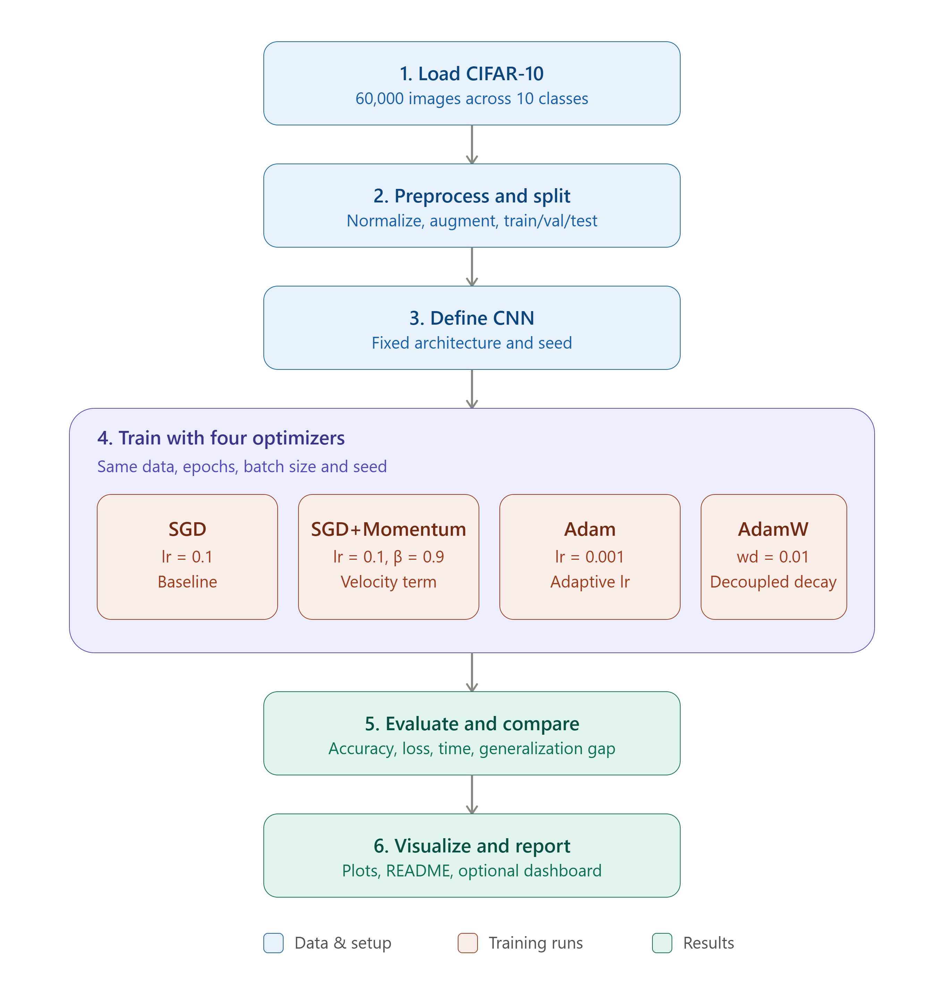

# optimizer-comparison-cnn

**Optimizer Behavior & Backprop Visualizer**

A hands-on deep learning project that trains the same CNN with four different optimizers on CIFAR-10 to empirically compare convergence speed, generalization, and training dynamics — built to demonstrate core neural network theory with real, reproducible results.

## Quick start

```bash
git clone https://github.com/AmirAziz1221/optimizer-comparison-cnn.git
cd optimizer-comparison-cnn
pip install -r requirements.txt
python train.py --optimizer all
```

## Table of contents

- [Part 1: Theory](#part-1-theory)
- [Part 2: Project Explanation](#part-2-project-explanation)

---

## Part 1: Theory

### 1.1 Neural Networks

A neural network is built from layers of neurons. Each neuron computes:

```
z = Wx + b
a = f(z)
```

where `W` is a weight matrix, `b` is a bias vector, and `f` is a nonlinear activation function (ReLU, sigmoid, tanh, GELU, etc.). Stacking these layers lets the network build up hierarchical representations: early layers detect simple patterns (edges, textures in images), and deeper layers combine these into complex concepts (shapes, objects).

Without the nonlinearity `f`, stacking layers would collapse into a single linear transformation — nonlinearity is what gives networks their expressive power.

### 1.2 Universal Approximation Theorem (UAT)

**Statement:** A feedforward neural network with a single hidden layer containing a finite number of neurons can approximate any continuous function on a compact subset of ℝⁿ to arbitrary precision, provided the activation function is suitable (non-linear, non-polynomial).

**Important nuances:**
- It is an **existence proof**, not a **learnability proof**. It guarantees such a network exists — it says nothing about whether gradient descent will actually find it.
- Achieving high precision with a single hidden layer can require an exponential number of neurons. This is why **deep** networks (many layers) are used instead of very **wide** shallow ones — depth gives exponentially better representational efficiency for compositional functions.
- UAT says nothing about generalization to unseen data — only about representational capacity.

### 1.3 Backpropagation

Backpropagation is the efficient application of the **chain rule** to compute the gradient of the loss with respect to every parameter in the network, propagating error signals from the output layer back to the input layer.

For any layer:

```
dL/dW = dL/da * da/dz * dz/dW
```

Instead of recomputing derivatives from scratch for each weight, backprop reuses intermediate gradients computed during the forward pass, making gradient computation roughly as expensive as a single forward pass — regardless of network depth.

**Why backprop enabled deep learning:**
- Before efficient backprop (popularized by Rumelhart, Hinton, and Williams in 1986), training multi-layer networks was computationally infeasible.
- Backprop reduced gradient computation from an intractable, per-weight numerical process to a single efficient backward pass.
- Combined with GPU parallelism and large datasets, this is what made training very deep networks practical, sparking the deep learning boom of the 2010s.

### 1.4 Gradient Descent

The core weight update rule:

```
w = w - lr * dL/dw
```

- **Learning rate (lr)** controls the step size. Too high causes divergence or oscillation; too low causes painfully slow convergence or getting stuck near saddle points.
- **Batch Gradient Descent**: computes the gradient over the full dataset per step — stable but slow.
- **Stochastic Gradient Descent (SGD)**: computes the gradient from a single sample — fast but noisy.
- **Mini-batch Gradient Descent**: the practical default, balancing speed and stability by using small batches.

### 1.5 Optimizers: SGD vs Momentum vs Adam vs AdamW

| Optimizer | Mechanism | Strengths | Weaknesses |
|---|---|---|---|
| **SGD** | Plain gradient step on mini-batches | Simple, tends to generalize well, low memory | Slow, sensitive to learning rate, struggles in ravines/saddle points |
| **Momentum** | Adds a velocity term: `v = β*v + dL/dw`, then `w = w - lr*v` | Dampens oscillation, accelerates in consistent-gradient directions | Still uses one global learning rate for all parameters |
| **Adam** | Combines momentum (1st moment) with adaptive per-parameter learning rates from squared gradients (2nd moment) | Fast convergence, robust default, adapts to each parameter's gradient scale | Weight decay is coupled with the adaptive update — can subtly hurt generalization |
| **AdamW** | Adam with **decoupled weight decay**, applied directly to weights instead of through the gradient/moment estimates | Fixes Adam's weight decay bug, better generalization, standard for fine-tuning transformers | Slightly more hyperparameters, though generally easier to tune well |

**Practical guidance:**
- **SGD + Momentum** is often preferred for CNNs on vision tasks when training budget allows careful learning-rate scheduling and the best possible generalization is the goal.
- **Adam / AdamW** is the default choice for NLP, transformers, GANs, and RL — fast, robust convergence with minimal tuning. AdamW is the near-universal choice for fine-tuning large pretrained models.
- Rule of thumb: use **Adam/AdamW to get something working fast**, and **SGD+Momentum when you have time to tune and want the best final generalization**.

---

## Part 2: Project Explanation

### 2.1 Objective

Train an identical CNN architecture from scratch on CIFAR-10 using four optimizers — **SGD**, **SGD+Momentum**, **Adam**, and **AdamW** — and produce a rigorous, empirical comparison of their convergence speed, generalization behavior, and training stability. A bonus module implements backpropagation manually (NumPy only, no autograd) on a small network to make the chain-rule computation fully explicit.

### 2.2 Problem Statement

Optimizer choice is often treated as a hyperparameter picked by convention or trial and error. This project replaces that convention with direct empirical evidence: by holding architecture, data, and hyperparameters constant except for the optimizer, we isolate and measure exactly what changing the optimizer does to training dynamics and final performance.

### 2.3 Dataset

**CIFAR-10**: 60,000 32x32 color images across 10 classes (50,000 train / 10,000 test).

Reasons for this choice:
- Small enough to train four full runs within a limited compute budget (including free-tier Colab).
- Complex enough that optimizer choice produces visibly different results — unlike MNIST, where nearly anything converges trivially.
- Directly available via `torchvision.datasets.CIFAR10`, requiring no manual preprocessing pipeline.

*Optional extension: substitute a small custom dataset relevant to your own domain (e.g., a subset from your computer vision projects) to make the comparison more distinctive.*

### 2.4 Methodology

1. Define one fixed CNN architecture (Conv-BatchNorm-ReLU blocks followed by fully connected layers).
2. Fix the random seed, data splits, batch size, and number of epochs across all four runs.
3. Train four separate models — identical in every respect except the optimizer:
   - SGD (`lr=0.1`)
   - SGD + Momentum (`lr=0.1, momentum=0.9`)
   - Adam (`lr=0.001`)
   - AdamW (`lr=0.001, weight_decay=0.01`)
4. Log training loss, validation loss, validation accuracy, gradient norms, and wall-clock time per epoch for each run.
5. Evaluate all four models on the held-out test set under identical conditions.

### 2.5 Block Diagram




### 2.6 Step-by-Step Execution Plan

1. **Environment setup** — Python, PyTorch, torchvision, matplotlib (Colab or local GPU).
2. **Data loading** — Load CIFAR-10 train/test sets; normalize using channel-wise mean `[0.4914, 0.4822, 0.4465]` and std `[0.2470, 0.2435, 0.2616]`; apply random crop and horizontal flip augmentation to the training set only.
3. **Model definition** — A compact 4-6 layer CNN (Conv-BN-ReLU blocks + 2 fully connected layers) kept identical across all runs.
4. **Training loop** — For each optimizer, train for the same number of epochs (e.g., 20-30) with the same batch size and initialization seed. Record per-step training loss, per-epoch validation loss/accuracy, gradient norms, and elapsed time.
5. **Optimizer configuration** — Apply the four configurations listed in Section 2.4.
6. **Analysis** — Overlay training/validation loss and accuracy curves for all four optimizers; compute the train-validation gap as a proxy for generalization; tabulate final test accuracy and time-to-convergence for each.
7. **Bonus: manual backpropagation** — Implement a 2-layer neural network in pure NumPy on a small dataset (e.g., MNIST subset or XOR), coding the forward pass, loss computation, and backward pass (chain rule) explicitly, without any autograd framework.
8. **Report** — Summarize findings, tying empirical results back to the theory in Part 1 (e.g., confirming or contrasting with the "Adam converges faster, SGD+Momentum generalizes better" pattern reported in the literature).

### 2.7 Deliverables

- Jupyter notebook / Python scripts implementing data loading, model, training loop, and evaluation for all four optimizers.
- Plots: loss curves, accuracy curves, generalization gap, training time comparison.
- A NumPy-only manual backpropagation script/notebook (bonus module).
- This README, documenting theory and methodology.
- Optional: a small Streamlit/Gradio dashboard to interactively toggle optimizers and view live training curves.

### 2.8 References

- Rumelhart, Hinton, Williams (1986) — original backpropagation paper.
- Kingma & Ba (2014) — "Adam: A Method for Stochastic Optimization."
- Loshchilov & Hutter (2017) — "Decoupled Weight Decay Regularization" (AdamW).
